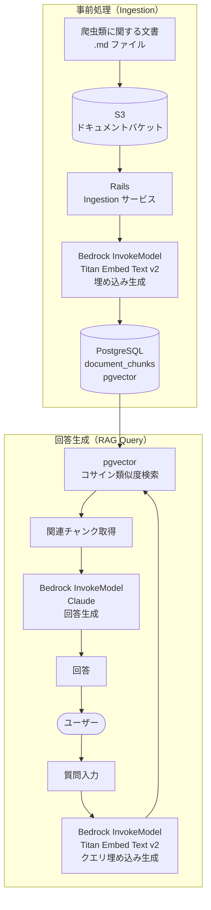
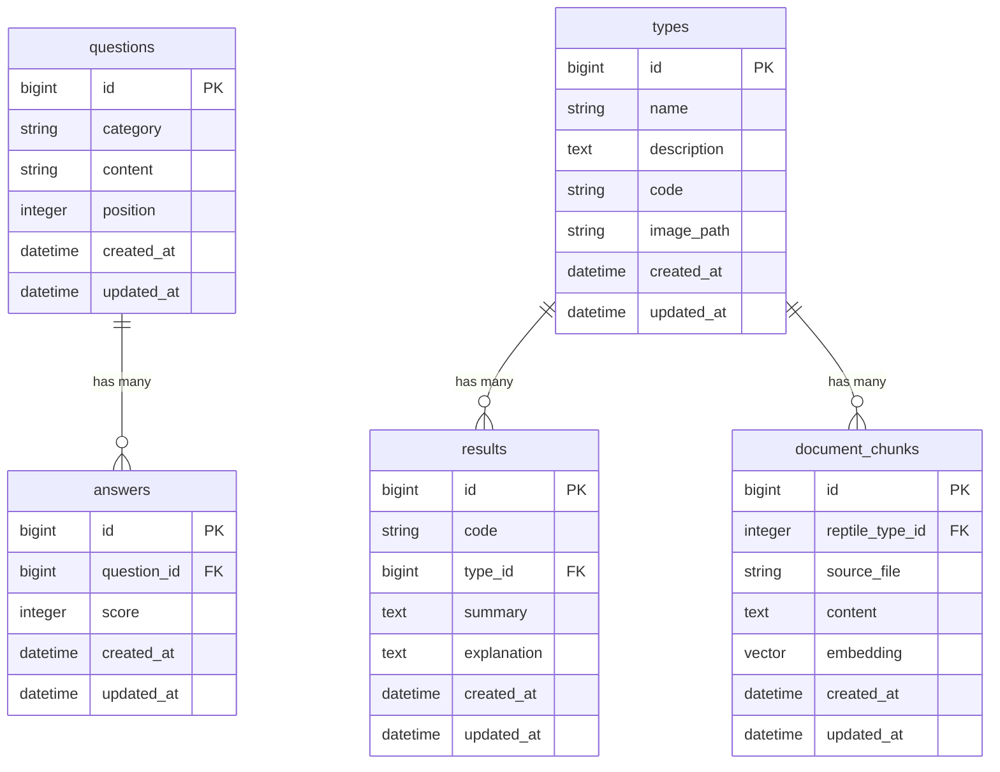

# reptype

**URL:** https://16reptype.com

## サービス概要

「爬虫類を飼いたいけど、どの種類が自分に合っているかわからない」という初心者向けに、最適な爬虫類をレコメンドするWebサービスです。

いくつかの質問に答えるだけで、生活スタイルや好みに基づいて16種類の中から飼育に向いている爬虫類を提案します。診断結果では、その爬虫類の特徴や飼育のポイントも確認できます。

## 使用技術

- **バックエンド:** Ruby on Rails
- **データベース:** PostgreSQL（Amazon RDS）
- **インフラ:** AWS（ECS Fargate / RDS / Route53）
- **IaC:** Terraform

## チャット機能構成（reptype-chat）

S3に保存された爬虫類に関する文書をもとに、pgvector（PostgreSQL 拡張）と Amazon Bedrock を組み合わせたカスタム RAG でユーザーの質問に回答するチャット機能の概要です。

### インフラ構成（Terraform）

| モジュール | リソース | 用途 |
|---|---|---|
| `modules/s3_storage` | S3 バケット | 爬虫類ドキュメントの保管 |
| `modules/iam_bedrock_invoke` | IAM ポリシー | Rails から Bedrock InvokeModel を呼び出す権限 |
| PostgreSQL (既存 RDS) | pgvector 拡張 | ベクトル検索（追加コストなし） |

## E-R図

