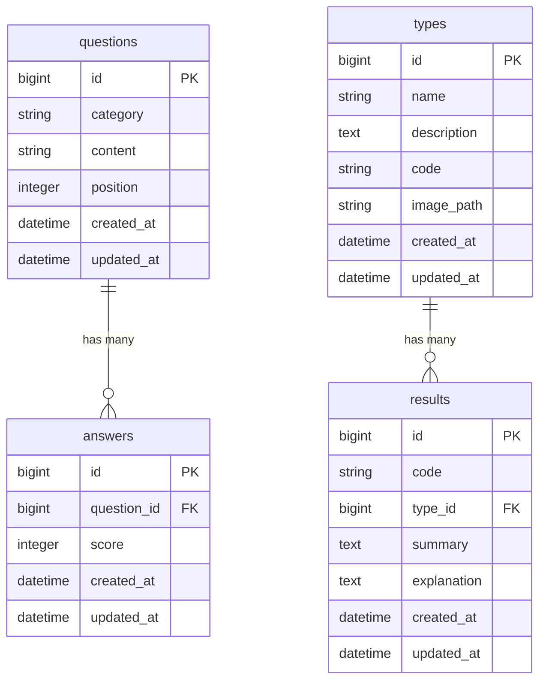

# reptype

**URL:** https://16reptype.com

## サービス概要

質問に答えるだけで、自分の性格タイプを診断できるWebサービスです。

複数のカテゴリにわたる設問に回答すると、スコアに基づいて、16種類の中からあなたの性格に合った爬虫類タイプを診断します。診断結果ではタイプの特徴や説明を確認できます。

## 使用技術

- **バックエンド:** Ruby on Rails
- **データベース:** PostgreSQL（Amazon RDS）
- **インフラ:** AWS（ECS Fargate / RDS / Route53）
- **IaC:** Terraform

## E-R図

