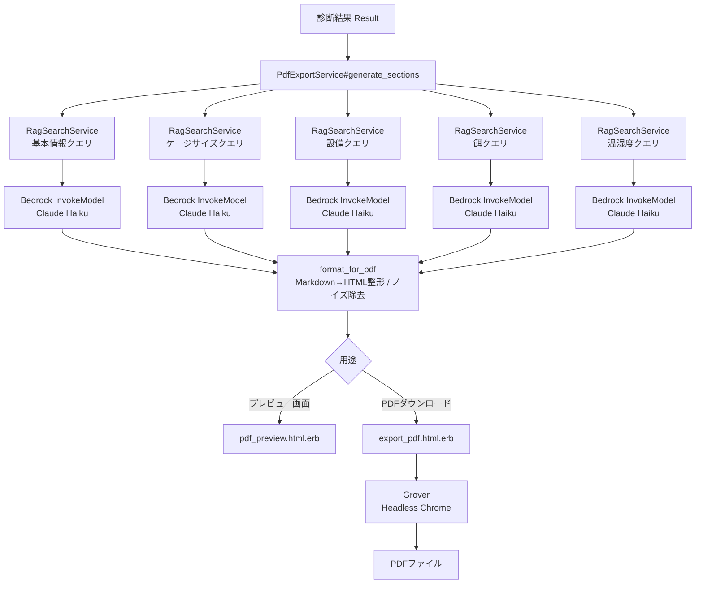

<!-- テックブログ下書き（土台）
  対象PR群: #124, #125, #129, #141, #143, #144, #146, #149, #150 ほか
    - Add Grover infrastructure for reptile PDF export (94002b5)
    - Add PdfExportService and export_pdf action (upper half) (0f377fa, #124)
    - Fix reptile image overflow/clipping in PDF template (#125)
    - Add cage size and equipment sections to PDF lower-left (8051509)
    - Fix markdown rendering and remove noise from PDF output (dc30f67)
    - Fit PDF to single page and clean up cage size output (c11f7f7) (#129)
    - Add feeding section to PDF lower-right (#141)
    - fix: PDF生成時のAI出力HTMLインジェクション脆弱性を修正 (7264664)
    - fix: PDF画像読み込み時のパストラバーサル脆弱性を修正 (86b2c46) (#143)
    - fix: PDF画像パスにサブディレクトリを含むimage_pathを使用するよう修正 (6c897e7) (#144)
    - Add temperature and humidity section to PDF lower-right (#146)
    - Parallelize Bedrock calls in PdfExportService (#149)
    - Add PDF preview page with download button (#150)

  この下書きの位置づけ:
    - あくまで「土台」。見出し構成・素材（コード引用/コミット事実）は実装から拾っているが、
      文章の温度感・結論・スクリーンショット・数値（レイテンシ実測値など）は執筆者が埋める。
    - [TODO] と書いた箇所は加筆・確認が必要な部分。
    - 今回のPR群と直接関係しない bundler-audit などのセキュリティCI整備（#147, #148）は
      スコープ外として意図的に含めていない。
    - 期間中に副次的に入った Ingestion 自動化ワークフロー（c28fa02）だけは「その他」として
      末尾に軽く触れる。
-->

# 診断結果をPDFの「ケアシート」として出力する機能を作った話

## [TODO] 想定読者・要約（3行程度）

- Rails + Bedrock（Claude）+ RAG で診断結果を元にAIが文章を生成し、Grover（Headless Chrome）でPDF化する機能を作った
- 実装を進める中で見つかったセキュリティ上の問題（HTMLインジェクション・パストラバーサル）と、その修正内容
- Bedrock呼び出しの並列化やプレビュー画面の追加など、UXと速度の両面で行った改善

## 1. 背景・作りたかったもの

reptype は、いくつかの質問に答えると自分の生活スタイルや好みに合った爬虫類を提案してくれるWebサービス。診断結果画面ではおすすめの爬虫類とその特徴を確認できるが、そこで表示されるのはテキスト中心の情報で、画面をスクロールしながら読む形になっていた。

爬虫類を飼うかどうかを検討している人が本当に知りたいのは、特徴の説明そのものよりも「実際にどれくらいのケージが必要で、どんな設備を揃えて、どう世話をしていくのか」という具体的な飼育イメージだと思う。診断結果を見た瞬間に必要なケージのサイズや設備、餌や温湿度管理まで一目で把握できたほうが、「自分の部屋でも飼えそうだ」という納得感につながり、購入を検討する後押しになるはずだと考えた。

そこで、診断結果に紐づく飼育情報を1枚のPDFの**「ケアシート」**としてまとめてダウンロードできる機能を作ることにした。画面をスクロールして情報を拾うのではなく、1つのPDFとして手元に残せる形にすることで、購入を検討している段階から実際に飼い始めた後の育て方の確認まで、通して使える資料にすることを狙っている。

ケアシートには以下の情報を1ページに収めて出力する。

- 爬虫類の画像と基本情報（特徴・性格・飼育のポイント）
- ケージのサイズ（最低サイズ／推奨サイズ）
- 必要な設備（暖房器具・シェルター・床材）
- 餌の種類と給餌頻度
- 適切な温度・湿度

[TODO] 完成イメージのスクリーンショットを貼る（`pdf_preview` 画面 / 出力PDF）

## 全体アーキテクチャ

reptype にはもともと、S3に保存した爬虫類ドキュメントを Bedrock の埋め込みモデルでベクトル化し、pgvector で類似検索する RAG の仕組み（チャット機能）があります。PDF生成でもこの資産をそのまま流用し、「セクションごとにRAG検索→Bedrockで文章生成→Markdown的な記法をHTMLへ整形→HTMLをGroverでPDF化」という流れにしました。



セクション生成部分（`generate_sections`）は、プレビュー画面とPDF生成の両方から共通で呼ばれる作りになっています。

## 実装のポイント

### Grover / Headless Chrome基盤の導入

PDF生成には [Grover](https://github.com/Studiosity/grover)（Puppeteer/Headless ChromeでHTMLをPDF化するgem）を採用しました。Rails側のビュー（ERB）をそのままPDFのレイアウトとして描画できる点が決め手でした。

コンテナ環境で動かす都合上、Dockerfile側で Node.js と Chromium を同梱し、Puppeteer自体のChromiumダウンロードはスキップして、OSパッケージのChromiumを指す形にしています。

```dockerfile
# nodejs/chromium: Grover (PDF export) uses Puppeteer which requires Node.js + headless Chrome at runtime
# fonts-noto-cjk: Japanese character rendering in PDF
RUN apt-get install --no-install-recommends -y curl libjemalloc2 libvips postgresql-client \
      nodejs chromium fonts-noto-cjk

ENV GROVER_EXECUTABLE_PATH="/usr/bin/chromium" \
    PUPPETEER_SKIP_CHROMIUM_DOWNLOAD="true"
```

`fonts-noto-cjk` を入れているのは、日本語フォントが無いとPDF上で文字が豆腐（□）になってしまうためです。[TODO] ここでハマった点があれば追記（フォント抜けで文字化けした画面など）

出力設定（A4・余白・余白なしのプレビューヘッダ抑制など）は `config/initializers/grover.rb` にまとめています。

```ruby
Grover.configure do |config|
  config.options = {
    format: "A4",
    margin: { top: "12mm", bottom: "12mm", left: "12mm", right: "12mm" },
    print_background: true,
    executable_path: ENV["GROVER_EXECUTABLE_PATH"].presence,
    launch_args: ["--no-sandbox", "--disable-setuid-sandbox", "--disable-dev-shm-usage"],
    viewport: { width: 794, height: 1123 }
  }.compact
end
```

`--no-sandbox` はコンテナ内でChromiumを起動するための定番設定です。[TODO] 本番相当環境でのサンドボックス運用について一言添えるか検討。

### RAGでのセクション別生成

PDFの各セクション（基本情報／ケージサイズ／設備／餌／温湿度）は、それぞれ専用のクエリでRAG検索した上で、セクションごとに異なるプロンプトでBedrockに文章化させています。

```ruby
DESCRIPTION_QUERY = "基本的な特徴・性格・飼育のポイントを教えてください"
CAGE_SIZE_QUERY   = "推奨されるケージのサイズを教えてください"
EQUIPMENT_QUERY   = "必要な暖房器具・シェルター・床材を教えてください"
FEEDING_QUERY     = "餌の種類と給餌頻度を教えてください"
TEMPERATURE_QUERY = "適切な温度と湿度の管理方法を教えてください"
```

最初は基本情報（上段）だけの実装からスタートし、ケージサイズ・設備（下段左）→餌（下段右）→温湿度（下段右）と、PRを分けて段階的にセクションを追加していきました。各セクションで「箇条書きの形式を固定する」「タイトル行を含めない」など、プロンプト側でかなり細かく出力フォーマットを指定しているのがポイントで、ここを詰めないとPDFのレイアウトが安定しません。

```ruby
def cage_size_prompt
  <<~PROMPT
    あなたは爬虫類飼育の専門家です。
    (中略)
    各項目は「• **最低サイズ**：幅〇〇cm×奥行〇〇cm×高さ〇〇cm」「• **推奨サイズ**：幅〇〇cm×奥行〇〇cm×高さ〇〇cm」の形式で必ず記載してください。
    (中略)
    「参考1」「参考2」などの参考番号は回答に含めないこと。
    情報が不足している場合の断り書きも不要です。
  PROMPT
end
```

とはいえプロンプトだけで完全に制御しきれるわけではなく、実際には「参考1」のような残骸や断り書きが混じることがあったため、後述のとおりアプリケーション側でもノイズ除去を行っています。

### Bedrock呼び出しの並列化（Concurrent::Future）

セクションが5つに増えると、Bedrockへの呼び出しを直列に行った場合、単純計算で1回あたりの応答時間の5倍待つことになります。RailsではすでにActiveJob等の依存で `concurrent-ruby` が使えるため、新しいgemを追加せずに `Concurrent::Future` で5並列化しました。

```ruby
def generate_sections
  futures = {
    description: Concurrent::Future.execute { generate_description },
    cage_size:   Concurrent::Future.execute { generate_section(CAGE_SIZE_QUERY,   cage_size_prompt) },
    equipment:   Concurrent::Future.execute { generate_section(EQUIPMENT_QUERY,   equipment_prompt) },
    feeding:     Concurrent::Future.execute { generate_section(FEEDING_QUERY,     feeding_prompt) },
    temperature: Concurrent::Future.execute { generate_section(TEMPERATURE_QUERY, temperature_prompt) }
  }
  futures.transform_values { |f| format_for_pdf(f.value!) }
end
```

`f.value!` を使うことで、Future内で例外が起きた場合にそれを呼び出し元まで伝播させています（`value` だと例外が握りつぶされて `nil` になってしまいます）。合計の待ち時間が「直列5回分」から「並列1回分（最も遅い呼び出し）」に短縮されました。

[TODO] Before/Afterの実測値（例: 直列◯秒→並列◯秒）を入れると説得力が増します

### Markdown風記法→HTML整形とノイズ除去

Bedrockの応答は完全な自由文ではなく、プロンプトで `**太字**` や `•` 箇条書きなど軽量なMarkdown風の記法を使うよう指示しているため、それをPDF/プレビュー画面用のHTMLへ変換する `format_for_pdf` を用意しました。あわせて、プロンプトで抑制しきれなかった「参考1」等の残骸行を正規表現で除去しています。

```ruby
NOISE_PATTERNS = [
  /参考\d+/,
  /正確な回答をするため/,
  /適切な参考情報/,
  /情報の提供をお願い/
].freeze

def format_for_pdf(text)
  return nil if text.blank?

  lines = text.lines.reject { |line| NOISE_PATTERNS.any? { |pat| line.match?(pat) } }

  lines.map do |line|
    escaped = ERB::Util.html_escape(line)
    escaped = escaped.gsub(/^#+\s*(.+)$/) { "<strong>#{$1.strip}</strong>" }
    escaped = escaped.gsub(/\*\*(.+?)\*\*/) { "<strong>#{$1}</strong>" }
    escaped
  end.join
end
```

ここは後述のセキュリティ修正で処理順序を変更しているため、詳細は「セキュリティ対応」で扱います。

### 1ページに収まるレイアウト調整

セクションが増えるにつれて、PDFが2ページ目にはみ出す・画像がカードからはみ出すといった見た目の崩れが発生しました。テンプレート側の高さをA4の1123pxに固定して `overflow: hidden` とし、余白・フォントサイズを全体的に縮小することで1ページ厳守のレイアウトにしています。[TODO] Before/Afterのレイアウト崩れスクショがあると分かりやすいです

### プレビュー画面の追加

PDFはダウンロードするまで中身が見えないため、「生成 → 中身がイマイチ → もう一度」のたびにダウンロードが発生するのは体験として重くなります。そこで `generate_pdf` から `generate_sections` を切り出し、PDF生成とプレビュー画面（`pdf_preview` アクション）の両方から共通で使えるようにしました。

```ruby
def generate_pdf
  sections  = generate_sections
  image_uri = build_image_data_uri
  html      = render_html(**sections, image_uri: image_uri)
  Grover.new(html, **Grover.configuration.options).to_pdf
end
```

診断結果画面（`show.html.erb`）に「もっと詳しく見る」リンクを追加し、別タブでプレビュー画面を開き、そこから「PDFダウンロード」できる導線にしました。

[TODO] プレビュー画面のスクリーンショット

## セキュリティ対応

実装を進める中で、AIの出力とユーザー由来のデータをHTML化してPDFに埋め込むという構造上、2つの脆弱性が見つかり修正しました。

### AI出力によるHTMLインジェクションの修正

`format_for_pdf` は当初、Bedrockの応答テキストに対して直接 `#見出し` → `<strong>`、`**太字**` → `<strong>` の正規表現置換をかけてから `raw` でHTMLに埋め込んでいました。これはつまり、Bedrockの応答に `<script>` のような任意のHTMLタグが含まれていた場合、そのままPDF/プレビュー画面にrawで展開されてしまうということを意味します。

修正は、**HTMLエスケープを先に行ってから、エスケープ済みのテキストに対してMarkdown風記法の変換をかける**という順序に変えるだけです。

```diff
   lines.map do |line|
-    # # 見出し → <strong>テキスト</strong>
-    line = line.gsub(/^#+\s*(.+)$/) { "<strong>#{$1.strip}</strong>" }
-    # **bold** → <strong>bold</strong>
-    line = line.gsub(/\*\*(.+?)\*\*/) { "<strong>#{$1}</strong>" }
-    line
+    escaped = ERB::Util.html_escape(line)
+    escaped = escaped.gsub(/^#+\s*(.+)$/) { "<strong>#{$1.strip}</strong>" }
+    escaped = escaped.gsub(/\*\*(.+?)\*\*/) { "<strong>#{$1}</strong>" }
+    escaped
   end.join
```

生成AIの出力を「信頼できない外部入力」として扱う必要がある、という典型例です。プロンプトで出力形式を指定していても、それを実行時の安全性の担保にはできません。

### 画像パスのパストラバーサル対策

爬虫類の画像は `@type.image_path` を `app/assets/images` 配下から読み込んでBase64化していますが、`image_path` に `../../config/database.yml` のようなパス区切りを含む値が渡された場合、アプリ内の任意ファイルを読み込んでPDFに埋め込めてしまう可能性がありました（`image_path` 自体は管理データ由来で外部から直接書き換えられる値ではありませんが、多層防御として対処しています）。

対策として以下を追加しました。

- ファイル名の形式チェック（`\A[\w\-]+\.\w+\z` に一致するbasenameのみ許可）
- 拡張子の許可リスト（`jpg jpeg png gif webp`）
- `realpath` で解決した実パスが `images_dir` 配下であることを確認

```ruby
ALLOWED_IMAGE_EXTENSIONS = %w[jpg jpeg png gif webp].freeze

def build_image_data_uri
  return nil unless @type.image_path.present?

  basename = File.basename(@type.image_path)
  ext      = File.extname(basename).delete(".").downcase
  return nil unless basename.match?(/\A[\w\-]+\.\w+\z/) && ALLOWED_IMAGE_EXTENSIONS.include?(ext)

  images_dir = Rails.root.join("app/assets/images")
  file_path  = images_dir.join(@type.image_path)

  return nil unless File.exist?(file_path)
  return nil unless file_path.realpath.to_s.start_with?(images_dir.realpath.to_s + "/")

  data      = Base64.strict_encode64(File.binread(file_path))
  mime_type = ext == "jpg" ? "jpeg" : ext
  "data:image/#{mime_type};base64,#{data}"
end
```

なお、最初の修正では `basename` だけでファイルパスを組み立てていたため、実際の画像がサブディレクトリ配下にある場合に読み込めなくなる副作用が出ました。最終的には「`basename` はバリデーション用途にのみ使い、実際のパス組み立ては元の `image_path`（サブディレクトリを含む）を使う。ただし `realpath` チェックで `images_dir` 配下から出ないことは保証する」という形に落ち着いています。安全性を担保しつつ既存の運用（サブディレクトリ管理）を壊さないための調整でした。

[TODO] このあたり、単体テストでどう担保しているか（あれば）触れる

## その他（Ingestion自動化ワークフローの追加）

ここまでとは少し毛色の違う話ですが、PDF生成の開発期間中に、ついでに **Ingestion（ドキュメント取り込み）の自動化** も行ったので軽く触れておきます。

PDFの各セクションはRAG検索で `reptype-chat/docs` 配下のドキュメントを参照しているのですが、これまでドキュメントを更新したら手動でIngestionコマンドを叩き直す必要がありました。地味に忘れがちな作業だったので、`reptype-chat/docs` 配下の変更を含むPRがmainにマージされたタイミングで、GitHub Actionsが自動的にS3へ同期し、ECS Fargate上でRailsの `ingestion:run_all` タスクを実行するワークフローを追加しています。

```yaml
on:
  pull_request:
    branches: [main]
    types: [closed]
    paths:
      - 'reptype-chat/docs/**'
```

PDF生成機能そのものではありませんが、PDFの各セクションが参照するRAGの元データを常に最新化しておく、という意味では地味に効いている改善です。

## まとめ

[TODO]

- できるようになったこと
- 今後の課題・展望（例: セクションごとの生成失敗時のフォールバック、レイアウトバリエーション、多言語対応など）
